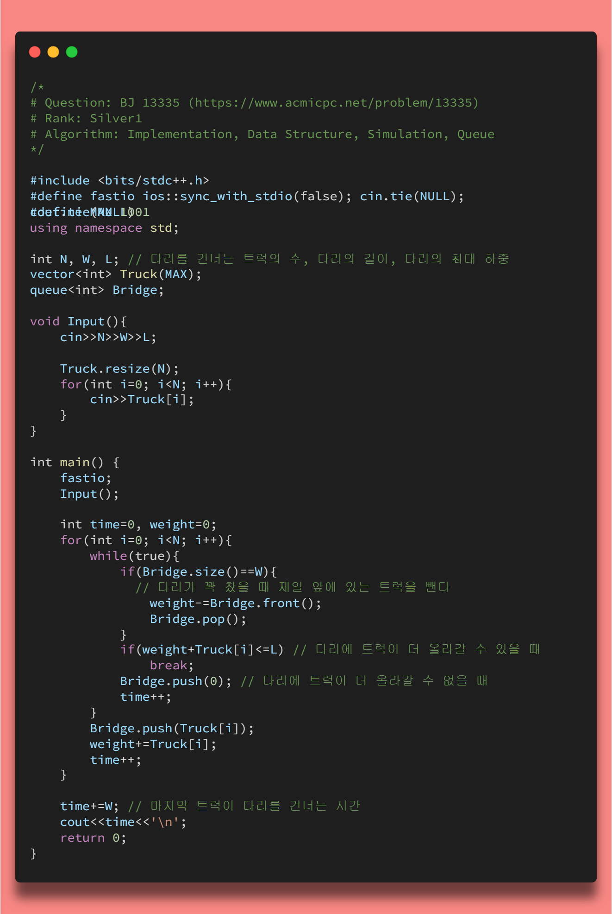

## <https://www.acmicpc.net/problem/1865>




## 풀이 전략

> 먼저 문제를 해석해보면 TC개의 Test case가 있고 각각의 Test case는 N개의 지점, M개의 양방향 도로, W개의 웜홀이 존재한다. 이 때 웜홀의 경우는 단방향 도로이고 웜홀을 통과하게 되면 시간이 거꾸로 흐르게 된다. 그렇기 때문에 음수 Cycle이 존재할 가능성이 존재하기 때문에 ```BellmanFord```알고리즘을 이용하여야 한다. (```Dijkstra```알고리즘의 경우 음수 사이클을 고려하지 않는다.)
>
>```BellmanFord```알고리즘을 이용하여 시간(cost)을 구하고 만약 한 사이클을 돌았는데 cost의 총합이 음수인 경우 문제에서 구하고자 하는 `출발을 하였을 때보다 시간이 되돌아가 있는 경우`에 해당하기 때문에 ```YES```를 출력하고 그렇지 않은 경우 ```NO```를 출력한다.

## 풀이


위의 그림을 보면 Test case, 도로의 정보, 웜홀의 정보에 대한 입력을 받는다. 나같은 경우 뭔가 개수가 맞지 않는 것 같아서 입력 예시를 해석하는데 시간이 좀 걸렸다. 알고보니 두 번째 case에 도시는 3개인데 도로가 2개만 존재한 것을 간과해서 그렇다. 두 번째 case의 경우 ```3-1```로 가는 경로는 오직 웜홀만 갈 수 있다. 그러므로 ```1-2-3```을 거쳐서 다시 ```1```로 가는 경로는 왔던 경로를 다시 돌아가거나 웜홀을 통해 가는 경로 2가지 가 존재한다.

```BellmanFord``` 알고리즘의 특징은 **모든 경우의 수를 전부 탐색해 가면서 최소비용을 찾는 것**이다. 그렇기 때문에 다른 최단경로 알고리즘 (```Dijkstra```, ```Floyd-Warshall```) 들보다는 시간은 오래걸릴지는 몰라도 음수 사이클이 존재하는 경우도 사용할 수 있기 때문에 사용하지 않나 싶다.

### BellmanFord 알고리즘 동작 원리

1.모든 간선들을 탐색하면서, 간선이 있는 ```from``` 정점이 ```한번이라도 계산된 정점```이라면 해당 간선이 있는 정점 사이의 거리를 비교해서 업데이트 한다.

```cpp
if(Dist[from] + cost < Dist[to])
    Dist[to] = Dist[from] + cost;
```

2.위의 과정을 모든 정점들에서 나오는 간선들을 최단거리로 연결할 수 있을때까지 반복한다.

## 소스 코드

```cpp
/*
# Question: BJ 1865 (https://www.acmicpc.net/problem/1865)
# Rank: Gold3
# Algorithm: Graph, Bellman-Ford
*/

#include <bits/stdc++.h>
#define fastio ios::sync_with_stdio(false);cin.tie(NULL);cout.tie(NULL);
#define MAX 501
using namespace std;
typedef pair<pair<int, int>, int> piii;
const int INF = 1e9;

vector<piii> Road;
int Dist[MAX];

void BellmanFord(int n){
    for(int i=0; i<n; i++){
        for(int j=0; j<Road.size(); j++){
            int from = Road[j].first.first;
            int to = Road[j].first.second;
            int cost = Road[j].second;

            if(Dist[from] + cost < Dist[to])
                Dist[to] = Dist[from] + cost;
        }
    }
    for(int i=0; i<Road.size(); i++){
        int from = Road[i].first.first;
        int to = Road[i].first.second;
        int cost = Road[i].second;

        if(Dist[from] + cost < Dist[to]){
            cout<<"YES\n";
            return;
        }
    }
    cout<<"NO\n";
}

int main() {
    fastio

    int TC;
    cin >> TC;

    while (TC--){
        int N, M, W;
        cin >> N >> M >> W;
        for (int i = 1; i <= N; i++)
            Dist[i] = INF;

        for (int i = 0; i < M; i++){
            int S, E, T;
            cin >> S >> E >> T;
            Road.push_back({{S, E}, T});
            Road.push_back({{E, S}, T});
        }
        for (int i = 0; i < W; i++){
            int S, E, T;
            cin >> S >> E >> T;
            Road.push_back({{S, E}, -T});
        }
        BellmanFord(N);
        Road.clear();
    }
    return 0;
}
```

## 결과


