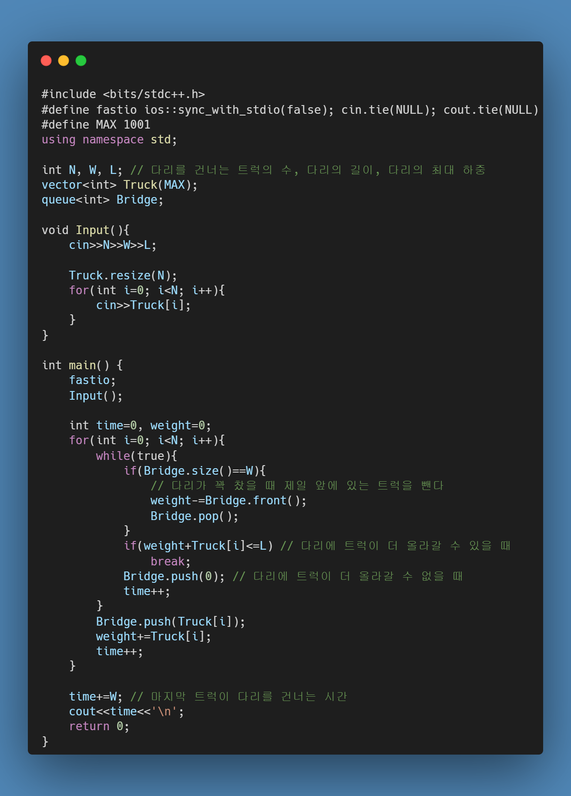
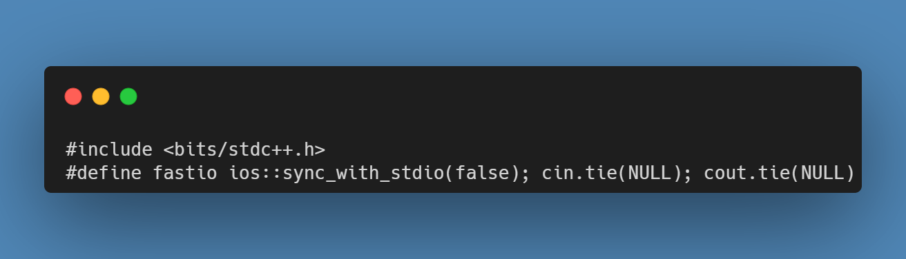
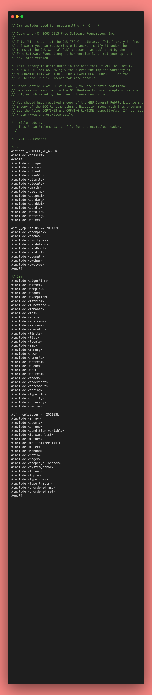

## <https://www.acmicpc.net/problem/12100>



[Play 2048](https://play2048.co/)

이 링크를 누르면 2048을 play 할 수 있습니다.



## 풀이 전략

2048의 경우 한 번 움직일 때마다 새로운 칸에서 (보통) 2가 생성되고 계속 게임을 이어나갈 수 있게 된다. 2048의 전략이라고 하면 최대한 큰 숫자를 제일 아랫줄에서 생성을 해야 한다.(본인의 경험상)
이 문제의 경우 2048의 규칙은 따르지만, 새로운 숫자가 생성되지는 않고 입력으로 받은 숫자들을 최대 5번 움직였을 때 가장 큰 숫자를 만들 수 있는지를 따져보고 만들어진 가장 큰 숫자를 출력하는 문제이다. 따라서 숫자가 이동하는 방향에 따라 case를 나눠줘야 한다고 생각을 했다.

## 풀이

1. 4방향으로 숫자들이 움직이는데, 이 때 빈칸의 경우 0이라고 고려를 하고 움직인 뒤 나머지 칸에 0을 채워주었다.

2. 왼쪽으로 움직이는 경우 ```i=1~N```, ```j=1~len(row)``` 순으로 탐색을 하였지만, 오른쪽의 경우는 역순으로 탐색을 하였다. 그렇게 한 이유는 숫자들이 움직이는 방향쪽으로 생성이 되기 때문에 움직이는 방향과 일치시켜주어야 한다고 생각했기 때문이다.

3. 위아래 방향의 경우 좌우로 움직이는 경우에서 행렬을 transpose 한 경우와 동일하기 때문에 ```transpose``` 함수를 만들어서 transpose를 한 뒤 똑같은 code를 돌려주었다. 이 때 주의할 점은 transpose를 한 뒤 연산을 하고 마지막에 다시 transpose를 해주어야 한다. 마지막에 transpose를 하지 않게 되면 결국 좌우 연산 결과에 추가적으로 더해지는 셈이 되기 때문에 반드시 transpose를 한 번 더 해주어야 한다. 나 역시 이 부분을 놓쳐서 초반에 이상한 결과가 출력되었었다.

4. 최댓값을 찾는 방법의 경우 각각의 행에서 한번, 마지막으로 전체에서 한번 총 2번을 해주었다. 이중 for문으로 전체 행렬의 index를 탐색하면서 최댓값을 찾아주는 방법도 있지만, max 함수를 2번 쓰는게 조금 더 효율적일 것이라고 생각해서 이 방법으로 찾았다.

## 소스 코드

```python
# Question: BJ 12100 (https://www.acmicpc.net/problem/12100)
# Rank: Gold2
# Algorithm: Implementation, Simulation, Brute-force, Backtracking

import sys
input = sys.stdin.readline

N = int(input())
Board = [list(map(int, input().split())) for _ in range(N)]

def inRange(x, y):
    return 0 <= x < N and 0 <= y < N

def move(board, direction):
    if direction == 0: # 왼쪽
        for i in range(N):
            row = [x for x in board[i] if x]
            for j in range(1, len(row)): # 왼쪽부터 탐색
                if row[j] == row[j-1]:
                    row[j-1] *= 2
                    row[j] = 0
            row = [x for x in row if x]
            board[i] = row + [0]*(N-len(row)) # ex) 2 2 0 0 -> 4 0 0 0
    elif direction == 1: # 오른쪽
        for i in range(N):
            row = [x for x in board[i] if x]
            for j in range(len(row)-2, -1, -1): # 오른쪽부터 탐색
                if row[j] == row[j+1]:
                    row[j+1] *= 2
                    row[j] = 0
            row = [x for x in row if x]
            board[i] = [0]*(N-len(row)) + row  # ex) 0 0 2 2 -> 0 0 0 4
    elif direction == 2: # 위쪽
        board = Transpose(board)
        for i in range(N):
            row = [x for x in board[i] if x]
            for j in range(1, len(row)):
                if row[j] == row[j-1]:
                    row[j-1] *= 2
                    row[j] = 0
            row = [x for x in row if x]
            board[i] = row + [0]*(N-len(row))
        board = Transpose(board)
    else: # 아래쪽
        board = Transpose(board)
        for i in range(N):
            row = [x for x in board[i] if x]
            for j in range(len(row)-2, -1, -1):
                if row[j] == row[j+1]:
                    row[j+1] *= 2
                    row[j] = 0
            row = [x for x in row if x]
            board[i] = [0]*(N-len(row)) + row
        board = Transpose(board)
    return board

def Transpose(board):
    newBoard = [[0]*N for _ in range(N)]
    for i in range(N):
        for j in range(N):
            newBoard[j][i] = board[i][j]
    return newBoard

def moveAll(board, depth):
    if depth == 5:
        return max([max(row) for row in board]) # 행에서의 최댓값 -> 전체에서의 최댓값
    ret = 0
    for i in range(4):
        newBoard = move([row[:] for row in board], i) # 1번 이동한 board
        ret = max(ret, moveAll(newBoard, depth+1)) # 그때그때 최대값을 갱신
    return ret

print(moveAll(Board, 0))
                        
```

## 결과

